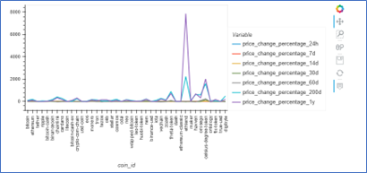
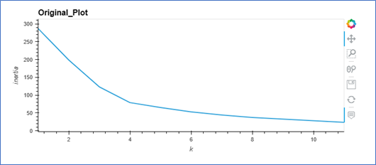
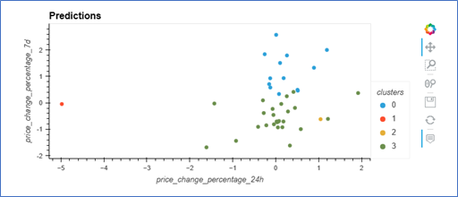
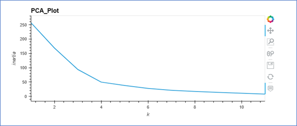
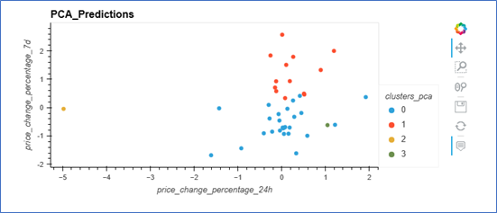
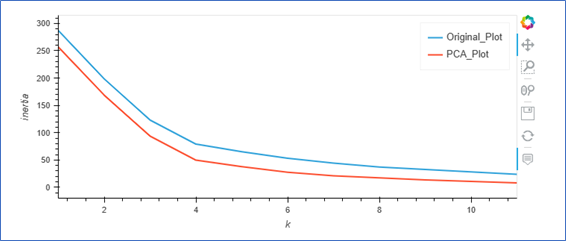
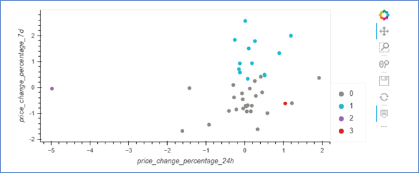

# CryptoClustering

## Background
In this analysis, Python and Principle Component Analysis for Unsupervised Machine Learning were used to predict if cryptocurrencies are affected by 24-hour or 7-day price changes.

## Results
For details and analysis, refer to the Jupyter Notebook file above.  Also, below are the visuals for easier reference:

<li>Initial line graph of dataset</li>

<li>Elbow curve of original data</li>

<li>Scatter plot of original data</li>

<li>Elbow curve after applying PCA to the data</li>

<li>Scatter plot after applying PCA to the data</li>

<li>Composite graph with both the Orignal and PCA elbow curves</li>

<li>Composite scatter with both the Original and PCA plots</li>

## Resources
#### Data Source: crypto_market_data.csv
#### Software/Tools: Python, Pandas, Jupyter, VSCode
